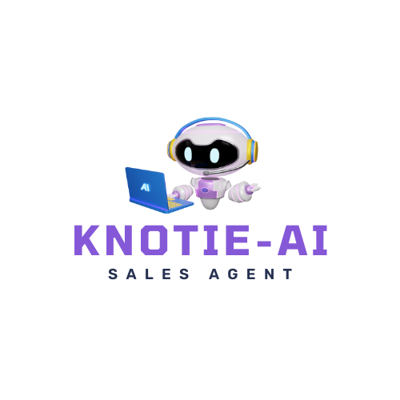

    <!-- Placeholder for Logo Icon -->
    

<h1 align="center">Knotie-AI</h1>

    

---

Knotie-AI is a completely open-source inbound/outbound AI Sales Agent that can communicate with your potential leads and customers.

For detailed documentation and setup instructions, please visit the [Knotie-AI Documentation](https://knotie-ai.pages.dev/).

---

## 🚀 Upcoming Features

| Feature                        | Description                                                                 | Potential Release Date | Status                                                                 | Contribute       |
|--------------------------------|-----------------------------------------------------------------------------|------------------------|------------------------------------------------------------------------|------------------|
| **Evaluation Script**          | A script to evaluate and test AI Agents before deployment                   | Q3 2024                |   | [Contribute](https://kno2gether.com/knotie-ai-sales-agent/) |
| **Cloud Deployment Guide**     | A comprehensive guide for deploying Knotie-AI on the cloud VPS              | Q3 2024                |   | [Contribute](https://kno2gether.com/knotie-ai-sales-agent/) |
| **Wordpress Plugin Update**    | Wordpress Integration through Plugin to call the AI Agent from Wordpress    | Q3 2024                |              | [Contribute](https://kno2gether.com/knotie-ai-sales-agent/) |
| **File-based State Management**| Support for file-based and cloud database state management                   | Q3 2024                |              | [Contribute](https://kno2gether.com/knotie-ai-sales-agent/) |
| **Reduce Latency to Response Time under 1 Sec** | Reduce the AI Sales Agent response latency under 1 Sec                      | Q4 2024                |              | [Contribute](https://kno2gether.com/knotie-ai-sales-agent/) |
| **Introduce & Support Assistant API**      | Support for OpenAI Threads & Assistant API to offload memory management/tool calling to Assistant | Q4 2024                |              | [Contribute](https://kno2gether.com/knotie-ai-sales-agent/) |
| **OpenAPI Specification Support** | Introduce custom API/tools by using OpenAPI/Swagger API Specs. No need to modify any code | Q4 2024                |              | [Contribute](https://kno2gether.com/knotie-ai-sales-agent/) |
| **Enhanced Admin UI**          | Introduce appropriate UI library and enhance Admin UI to manage/control AI Agent behaviour from the UI | Q4 2024                |              | [Contribute](https://kno2gether.com/knotie-ai-sales-agent/) |
| **Custom Workflow support**    | Create and manage Workflows, integrate with popular business software to be managed by the AI Sales Agent | Q4 2024                |              | [Contribute](https://kno2gether.com/knotie-ai-sales-agent/) |
| **Open Source AI Model Support**| Support Self Hosted Open Source AI Models                                   | Q4 2024                |              | [Contribute](https://kno2gether.com/knotie-ai-sales-agent/) |
| **One-Click Twilio Integration**| Integrate Twilio with one-click, instead of manually updating configs       | Q4 2024                |              | [Contribute](https://kno2gether.com/knotie-ai-sales-agent/) |
| **One-Click Third Party Tool Integration** | Integrate Popular third party SaaS such as Calendly, GHL to manage business by this AI Sales Agent | Q4 2024 |              | [Contribute](https://kno2gether.com/knotie-ai-sales-agent/) |
| **Twilio Streaming API Support**| Enhance AI Sales Agent With Twilio Streaming to make it faster and more efficient | Q4 2024                |              | [Contribute](https://kno2gether.com/knotie-ai-sales-agent/) |

## 🎥 Demo Video

Watch the Knotie-AI demo video to see it in action:

    

    

---

## 🤝 Contribute

We welcome all contributions to the Knotie-AI project! If you have ideas for new features, want to fix a bug, or just improve the documentation, your help is appreciated.

- **Fork the Repository**: Click the "Fork" button at the top of this page to create your own copy of the repository.
- **Create a Branch**: Create a branch for your feature or bugfix.
- **Make Your Changes**: Make any changes in your forked repository.
- **Submit a Pull Request**: Submit a pull request to have your changes reviewed and merged into the main repository.

Please see our [Code of Conduct](https://knotie-ai.pages.dev/CODE_OF_CONDUCT) for guidelines on contributing.

Join our [Discord Community](https://discord.com/invite/7UKpgUbEXf).
Join our [Kno2gether Club](https://community.kno2gether.com/communities/groups/kno2gether-community/home?invite=66b617e90fd0ff23e04efce2) to discuss features, ask questions, and share feedback.

---

## 📚 Documentation

- **Documentation Site**: [Knotie-AI Docs](https://knotie-ai.pages.dev/)
- **GitHub Repository**: [Knotie-AI on GitHub](https://github.com/avijeett007/knotie-ai)
- **Code of Conduct**: [Read Here](https://knotie-ai.pages.dev/CODE_OF_CONDUCT)
