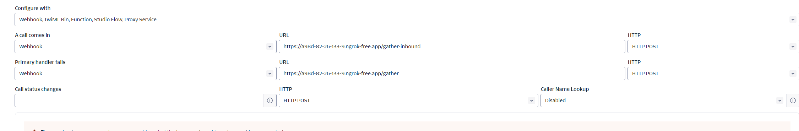

## Knotie-AI - A Completely Open-Source Inbound/Outbound AI Sales Agent which can communicate with your potential lead/customer.

# An AI Sales Agent With Tool/API Calling

## Description
This project consists of various Python modules, configuration, and Docker files to set up and run an AI Agent System efficiently. The project is aimed to be run with Docker. You don't need to install python or similar packages anymore to run the project locally. Ofcourse, if you wish to further modify the code, you need to install python and manage python env. Please follow below python setup guide.

 Below is the description of each file and their purpose in the project:

# How to Run the Project

### Prerequisites
- Docker
- Docker Compose
- Create a Twilio Account (Go to https://www.twilio.com/login and click Signup, follow the procedure)
- Create a free ElevenLabs Account (Go to https://try.elevenlabs.io/434k6rx9zk3h). This is an affiliate link which would give you upto 50% off on Creator plan for first month.
- Create a Free Groq Account and create keys from  (https://console.groq.com/keys). Groq API is free to test.
- For improved response from AI Agent, use OpenAI APIs. Register to OpenAI and create keys from https://platform.openai.com/account/usage
- Register yourself to NGROK (if you plan to run it from local) https://ngrok.com/
- Follow the guide from NGROK Website to download and run ngrok client/agent in your local system.
- Once your Twilio account is registered, create a phonenumber (https://console.twilio.com/us1/develop/phone-numbers/manage/incoming). Twilio provide free credit and a free phone number to test. For production usage, make sure to buy a local Number.
- Open a Terminal & run
   ```bash
   ngrok http 5000
   ```
   This will create a public link such as https://a98d-82-26-133-9.ngrok-free.app. Make a note of this URL
- Update this URL and API Keys/Account SID/Auth Tokens etc from Twilio, OpenAI, Eleven Labs into .env file as described in Run steps below.
- Make sure to go to Twilio Manage Phone number page and update 2 Section with the NGROK Public URl as screenshot below.
```bash
   This is a Must Step
   -------------------

   A Call Comes In --> https://ngrok_public_link/gather-inbound
   Primary Handler Fails --> https://ngrok_public_link/gather

   Click Save Changes
```



### Steps to Run
1. Clone the repository or download the files to your local machine.
2. Navigate to the project directory where `docker-compose.yml` is located.
3. Copy `.env_sample` to `.env` and modify the environment variables as per your requirements.
4. Run the following command to build and start the containers:
   ```bash
   docker-compose up --build
   ```
5. Once the containers are running, access the application via `http://localhost:5000` or another configur
ed port.

### Stopping the Application
- To stop the application, use the following Docker Compose command:
  ```bash
  docker-compose down
  ```
### Changing underlying code
- If you've changed any code in the application, please make sure to use the following Docker Compose command to rebuild the image and start it:
  ```bash
  docker-compose build --no-cache
  docker-compose up
  ```


## All Contribution are welcome ! Please follow the Contribute.md for the contribution guideline and please avoid updating code directly to 'develop' branch

# Project File Details

- **.env_sample**: A sample environment variable file that should be copied to `.env` for configuring the application secrets and settings.
- **ai_helpers.py**: Contains helper functions for AI operations, such as interacting with machine learning models or APIs.
- **app.py**: The main Python Flask application file that defines HTTP routes and the web server logic.
- **audio_helpers.py**: Includes functions to handle audio processing tasks within the application, such as audio file manipulation or audio stream processing using ElevenLabs API.
- **config.py**: Configuration file for setting up global variables and application settings.
- **docker-compose.yml**: Docker Compose file to define and run multi-container Docker applications. Specifies services, networks, and volumes.
- **Dockerfile**: A Dockerfile to build the Docker image for the application, specifying the environment, dependencies, and commands.
- **prompts.py**: Likely includes predefined prompts for different logic within this application. Note: This is a very generalized prompts to showcase the capability and give you guidance. You may want to change it as per your business requirement.s
- **stages.py**: Defines various stages or states of a process in a standard Sales Process, useful for workflow management or state tracking. Note: This is a very generalized stages. You may want to change it as per your business requirements.
- **tools.py**: Provides additional utility functions or tools that can be used throughout the application for various tasks.

# **Run Code without Docker**
**If you want to run the code without docker in your local, follow the steps**:
- Make sure to run redis locally (You can ask ChatGPT on how to run redis. Make sure to run it on 6379 port). The current code uses redis for state management (such as Conversation history etc).
- Make sure to install python 3.11 and above
- Install VirtualEnv or Anaconda
- Create a python env 
  ```bash
  conda create -n aisalesagent python=3.11
  ```
- Activate the env

  ```bash
  conda activate aisalesagent
  ```
- Download the zip or clone the repo
- Go Inside the folder and install all the requirement
  ```bash
  pip install -r requirements.txt
  ```
- Copy .env_sample to .env
  ```bash
  cp .env_sample .env
  ```
- Open .env in a text editor and update all the config properties as required.
- Run The Application
  ```bash
  python app.py

      OR

  FLASK_APP=app.py FLASK_ENV=development flask run --host=0.0.0.0 --port=5000
  ```
  
  # **Test Your AI Sales Agent**

  To Test The Agent, Install Postman or similar API execution platform
  Open Postman and click on import and paste the below CURL
   ```bash
  curl --location 'https://a98d-82-26-133-9.ngrok-free.app/start-call' \
   --header 'Content-Type: application/json' \
   --data '{
    "customer_name" : "Avijit",
    "customer_phonenumber": "+441234567890",
    "customer_businessdetails": "Looking for a gym membership to address back pain"
   }'
  ```
  - Make sure to change the public URL with your NGROK provided URL and phonenumber/businessdetails as per your testing requirement


  # **Further Improvement Suggestion**

  - Please make sure to update prompts as per your business use cases. The provided prompts in `prompts.py` is a very generalized prompt inspired from 'SalesGPT' Open Source Project
  - Please make sure to adjust Sales Stages based on your requirement. Again the current Sales Stages provided in `stages.py` is a very generalized stages inspired from 'SalesGPT' Open Source Project
  - If you want to test AI outputs before integrating with Twilio and ElevenLabs API first, I've a section commented out in `ai_helpers.py`. You can modify and use that section to test. ONLY MAKE CHANGES TO THE FILE IF YOU HAVE KNOWLEDGE IN PYTHON. OTHERWISE, It may break the application.
  - I'll further create an `evaluation.py` to allow you to evaluate and test AI Agents before you run it for your use case (This is currently WORK IN PROGRESS)
  - The current code relies on Redis for in-memory state management. I'll include file based and cloud database support for users who can't run Docker in their Local (Redis in their local) due to lower system specification. (WIP)
  - I'll include a guide on how to deploy this on cloud (WIP)
  - I'll update the Wordpress plugin to support tool calling, email address collection from customer etc (WIP)
  - If you've any other suggestion, please join Discord(https://discord.com/invite/7UKpgUbEXf) and raise your suggestion or feedback using **gumroad-product-support** channel.


