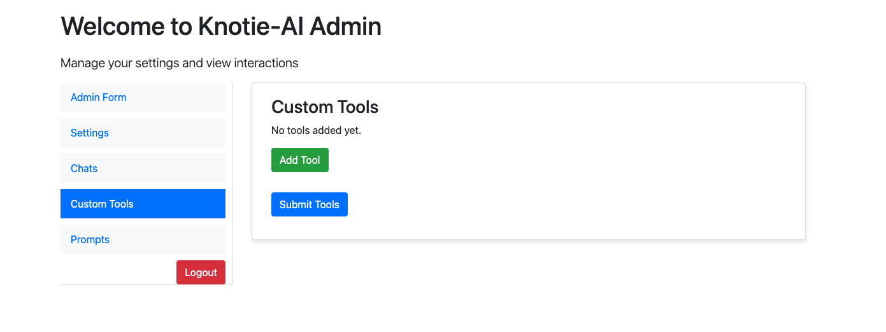
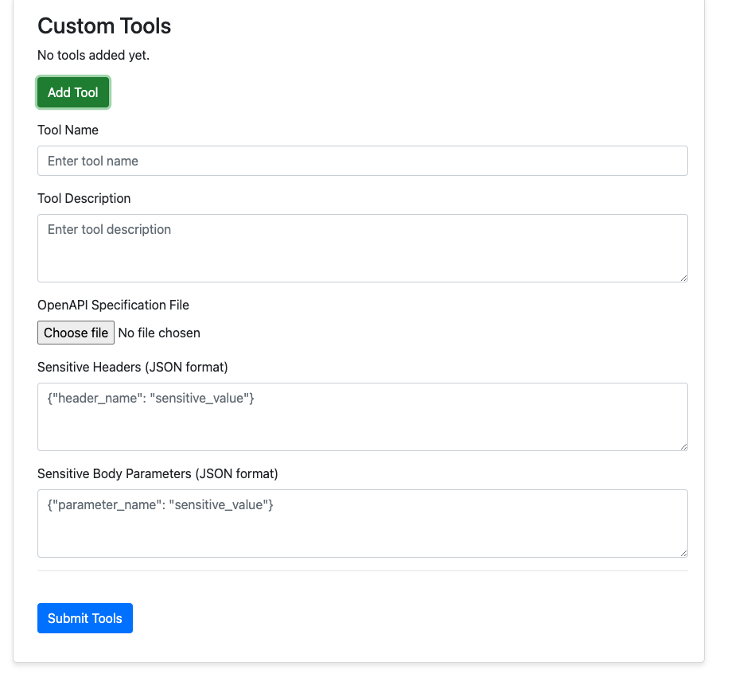
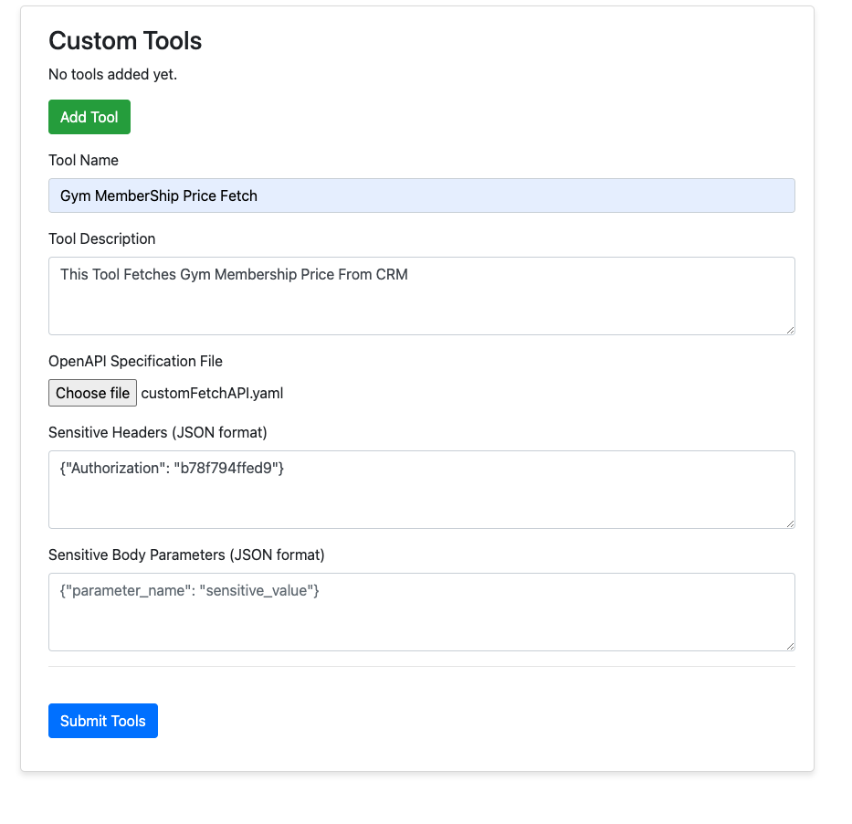

# 🛠️ Add Custom Tools and APIs via Admin UI

Integrating custom tools and APIs with Knotie-AI has become even more straightforward and easy. Now you don't need to fiddle with code anymore. That means Knotie-AI is becoming more Business Friendly. This guide will walk you through the steps required to add and configure your custom tools within the system.

---

## 🧩 Start Knotie-AI

First ensure Knotie-AI is started locally. Follow this [Guide](../Self-Hosting/runasservice.md). If you're a developer, follow this [Guide](../Self-Hosting/setup.md) instead.

---

## 📄 Open Admin UI

Once Knotie-AI is started, launch the recently updated Admin UI (With much more options added)
Follow this [Configuration and Secret Management Guide](../Self-Hosting/installation.md) to setup all important configuration first

---

## 🔧 Prepare Your Tools

To add tools through Admin UI, you need your API/Custom Tools to be available in OpenAPI 3.0 Specification (Yaml file)
If you already have OpenAPI 3.0 Compliant YAML, follow `Add Your Tools` Section in this guide.

If you don't have OpenAPI 3.0 Compliant YAML, then follow the below steps.


### 1. Prepare a CURL command for your tool/api

Open Postman or your favourite API Execution/Testing tool where you can test the custom API.
Execute the API once, to test, if everything is allright.

Now, copy the CURL command output for the api. It should look something like this -> 

```python
curl --location 'https://kno2getherworkflow.ddns.net/webhook/fetchMemberShip' \
--header 'Authorization: b78f794ffed9' \
--header 'Content-Type: application/json' \
--data '{
    "membership": "Gold-Gym-Membership"
}'
```

- **Remove any sensitive information:** From the Curl, remove any sensitive information, replace with "*****" or "SENSITIVE INFO"

```python
curl --location 'https://kno2getherworkflow.ddns.net/webhook/fetchMemberShip' \
--header 'Authorization: ************' \
--header 'Content-Type: application/json' \
--data '{
    "membership": "Gold-Gym-Membership"
}'
```

### 2. Create OpenAPI Spec Document

Use any AI Chatbot like ChatGPT, Bard or Bing AI and use the below prompt to convert the curl into an OpenAPI Specification Document.


```python
create openapi specification for the below curl API, dont keep the sensitive info like authorization header in the specification. Use the below Specification as an example guide.

CURL To Convert:
curl --location 'https://kno2getherworkflow.ddns.net/webhook/fetchMemberShip' \
--header 'Authorization: ************' \
--header 'Content-Type: application/json' \
--data '{
    "membership": "Gold-Gym-Membership"
}'

Example Spec Document:

openapi: 3.0.0
info:
  title: Appointment Booking API
  description: API for booking appointments via webhook.
  version: 1.0.0

servers:
  - url: https://kno2getherworkflow.ddns.net/webhook

paths:
  /bookAppointment:
    post:
      summary: Book an appointment
      operationId: bookAppointment
      description: Endpoint to book an appointment by providing the date, time, and customer name.
      parameters:
        - in: header
          name: Authorization
          schema:
            type: string
          required: true
          example: "sensitive value"
          description: Authorization header required to access this endpoint.
      requestBody:
        required: true
        content:
          application/json:
            schema:
              type: object
              properties:
                date:
                  type: string
                  example: "tomorrow"
                  description: "The date for the appointment."
                time:
                  type: string
                  example: "10:00"
                  description: "The time for the appointment."
                customer_name:
                  type: string
                  example: "John"
                  description: "Name of the customer booking the appointment."
              required:
                - date
                - time
                - customer_name
      responses:
        '200':
          description: Appointment booked successfully.
        '400':
          description: Invalid request.

```

Copy the above prompt, change your CURL output and use any AI Model to generate the OpenAPI Spec Document.

---

## 3. Add Your Tools

### 1.  Now Headover to ADMIN UI and click on Custom Tools. 


### 2.  Click on Add Tool (Green Button) and you should see a form like below image.



### 3.  Enter Your Tool Name : Please enter a valid and relevant tool name as this will be used by AI Model.

Enter Your Tool Description : This is very important that you add a brief appropriate description about what the Tool/API does. This is instrumental for AI Models to choose right tool during conversation.

### 4.  Upload OpenAPI Spec File.

### 5.  Now add Your Sensitive Headers as JSON. (Don't worry, the agent won't send header as JSON, this is for secure storing of your sensitive information)
For example (as per given API above, I'll add this, in the sensitive header text area)
```
{"Authorization": "b78f794ffed9"}
```

### 6.  Similarly, add any sensitive information which should be sent in request body.

### 7.  Submit Tools.


You can add as many custom API/Tools using the above process.

Note: This sensitive information won't be shared to any AI Model. This will be kept safely within Database, encrypted.

## ⚠️ Important Notes

- **Technical Complexity:** The Technical complexity behind this work was a milestone to achieve. We may not have been able to support all form of APIs(Nested/complex APIs). Please watchout the logs and if you face issues. Please raise a support request (If premium member), or please submit an issue through github Issue tab.
- **Future Improvements:** A more user-friendly framework for adding tools is in the works. Stay tuned for updates!

---

## 🎥 Video Tutorial

For additional help, please watch the tutorial video on YouTube and join our community. If you encounter any issues, feel free to ask for help in the "Ask For Help" channel.


[Watch the Tutorial](https://youtu.be/FlsN7rokbr0) | [Join the Community](https://community.kno2gether.com/communities/groups/kno2gether-community/home?invite=66b617e90fd0ff23e04efce2)
