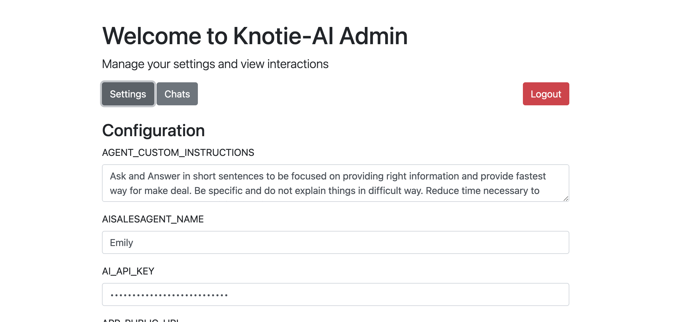
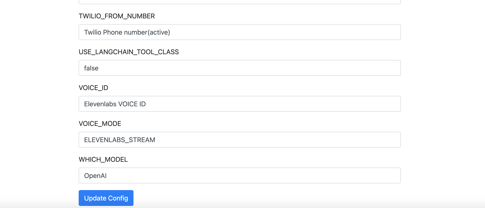

# Configuration and Secret Management

All the configurations and secrets for Knotie-AI are now managed through `config.json`. The recommended way to manage `config.json` is by using the Admin UI, which allows for hotloading of configurations.
Run The Code using either [Directly/Locally](deployment.md) or using [docker service](setup.md) or in the [cloud](../Cloud-Hosting/index.md)

---

## Accessing the Admin UI

1. **Start the Application:** Once the app is started, head over to your browser and navigate to: https://localhost:5000 (This is the default URL if you're running the application locally.)
Or navigate to https://your_server_ip:5000 
or navigate to https://your_application_public_url (If you're running ngrok or running this app behind an Proxy/LB)

2. **Login:** Use the following default credentials to log in:

   - **Username:** `admin`
   - **Password:** `admin`

   > **Important:** On your first login, you will be prompted to change the default credentials. Please remember the new password, as it is required for future logins.

---

## Updating Configurations and Secrets

1. **Access the Settings:**
   - Once logged in, locate the **Settings** link in the Admin UI. Click on it to access the configuration and secret management section.

2. **Edit Configurations:**
   - You can now update the necessary configuration and secret sections using the Admin UI.

3. **Save Changes:**
   - Ensure you hit the **Update** button to save your changes. This action will reinitialize all necessary clients to apply the new settings.

---

## Placeholder for Screenshots

---

## Important Notes

- **Remember Your Password:** After changing your password on the first login, ensure you remember it. If you forget it, you will need to follow the Reset User Documentation(#) to regain access.
- **Reinitialization:** Updating the configurations using the Admin UI triggers reinitialization of clients, so it's crucial to ensure that all settings are correct before applying them.

---

*Stay tuned for more updates and screenshots to make your configuration management experience even smoother!*